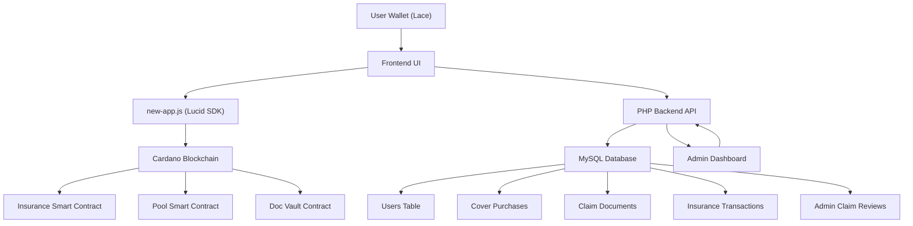

# 🛡️ CoxyInsure — Decentralized Insurance Protocol

CoxyInsure is a **DeFi insurance dApp on Cardano** that allows users to:
- Purchase insurance cover
- Submit claims with evidence
- Participate in governance voting
- Receive payouts through smart contracts

---

## 🚀 Features

### 👤 User Features
- 🔐 Connect Cardano wallet (Lace, etc.)
- 💰 Deposit ADA into liquidity pool
- 🛡️ Buy insurance cover
- 📄 Upload claim documents
- 🗳️ Vote on claims
- 📊 Track claim status

---

### 🏦 Protocol Features
- 💧 Shared liquidity pool
- 📈 Premium-based yield system
- ⚖️ Decentralized claim validation
- 🔄 On-chain claim execution
- 🧾 Backend transaction logging

---

### 🛠️ Admin Features
- 📊 Dashboard with live stats
- 🧾 Claim moderation (approve/reject)
- ⚙️ Execute payouts
- 👥 Membership tracking
- 🔍 Search & filter tools

---

## 🧠 Architecture Overview



---

## ⚙️ Tech Stack

### 🔗 Blockchain

* Cardano
* Plutus Smart Contracts
* Lucid (JavaScript SDK)

### 🌐 Frontend

* HTML
* CSS
* Vanilla JavaScript

### 🖥️ Backend

* PHP
* MySQL

---

## 🗄️ Database Structure

Core tables include:

* `users`
* `cover_purchases`
* `claim_documents`
* `claim_descriptions`
* `insurance_transactions`
* `admin_claim_reviews`
* `admins`

---

## 🔄 Core Workflow

### 🛡️ Buy Cover

1. Connect wallet
2. Select coverage
3. Pay premium
4. Cover stored in backend

---

### 📄 Submit Claim

1. Upload document
2. Add description
3. Claim recorded
4. Sent to governance

---

### 🗳️ Governance

1. Members vote
2. Threshold reached
3. Claim becomes executable

---

### 💸 Execute Claim

1. Admin executes claim
2. Smart contract releases funds
3. Transaction logged
4. Status updated

---

## 📦 Installation

```bash
git clone https://github.com/your-username/coxyinsure.git
cd coxyinsure
```

---

## 🔐 Environment Variables

```env
BLOCKFROST_URL=your_blockfrost_url
BLOCKFROST_KEY=your_api_key
NETWORK=Preprod
```

---

## 📊 Admin Access

* Open: `/admin-dashboard.php`
* Login with admin credentials
* Manage claims, covers, and governance

---

## 🧪 Testing

You can test with:

* Sample claim documents
* Test wallets
* Cardano testnet

---

## ⚠️ Security

* Claims require governance approval
* Only authorized signers execute payouts
* Wallet binding enforced
* Admin actions protected with CSRF

---

## 📸 Screenshots

Add screenshots here:

```
/docs/screenshots/dashboard.png
/docs/screenshots/claims.png
/docs/screenshots/governance.png
```

---

## 🛣️ Roadmap

* [ ] Multi-signature execution
* [ ] Risk scoring system
* [ ] Automated claim validation
* [ ] Mobile UI improvements

---

## 🤝 Contributing

Pull requests are welcome.
Open an issue for major changes.

---

## 📄 License

MIT License

---

## 👑 Author

**Coxygen Global**

> Building decentralized financial protection systems 🚀
