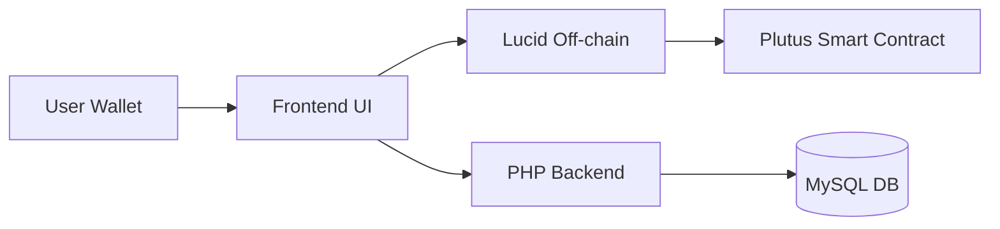
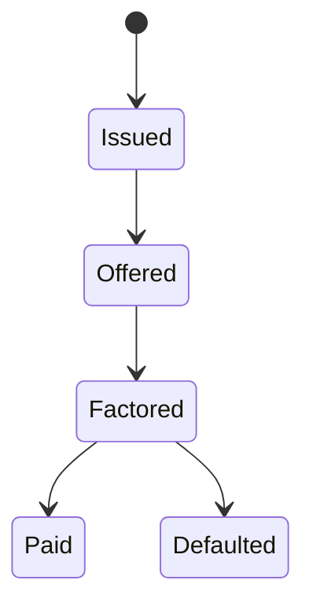

# System Design Document

## High-Level Architecture

---

## On-chain vs Off-chain Responsibilities

### On-chain (Plutus)

* Enforces invoice state transitions
* Validates funding and repayment
* Controls NFT ownership

### Off-chain (Lucid)

* Builds transactions
* Handles wallet interaction
* Submits transactions

### Backend (PHP)

* Authentication
* Wallet binding
* Transaction indexing

---

## Invoice Token Model

Each invoice is represented by:

* **NFT (1 unit)** → unique identifier
* Stored in UTxO with inline datum

---

## Lifecycle Model

---

## Datum Structure (Conceptual)

* Issuer (PubKeyHash)
* Invoice NFT
* Face Value
* Repayment Value
* Investors list
* Status flag

---

## Security Assumptions

* Users control private keys
* Smart contract enforces all transitions
* Backend is not trusted for financial state

---

## Tradeoffs

### eUTxO Model

Pros:

* Deterministic execution
* Strong security guarantees

Cons:

* Concurrency limitations
* Requires careful state design

---

## Data Placement

| Data          | Storage   |
| ------------- | --------- |
| Invoice state | On-chain  |
| UI data       | Off-chain |
| User data     | Backend   |

---