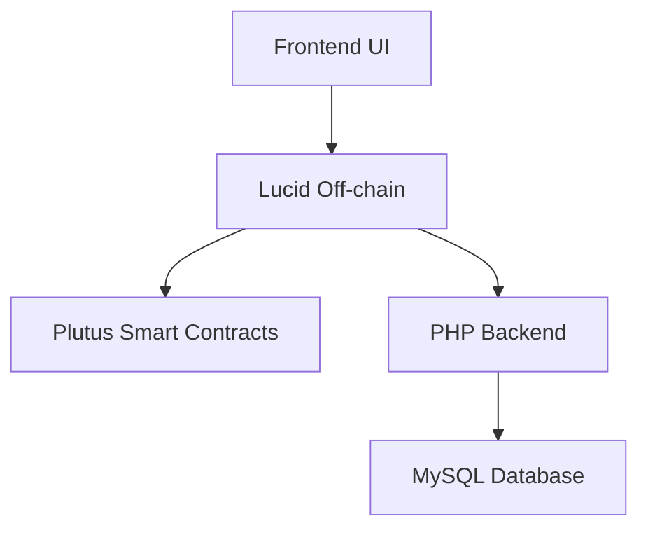
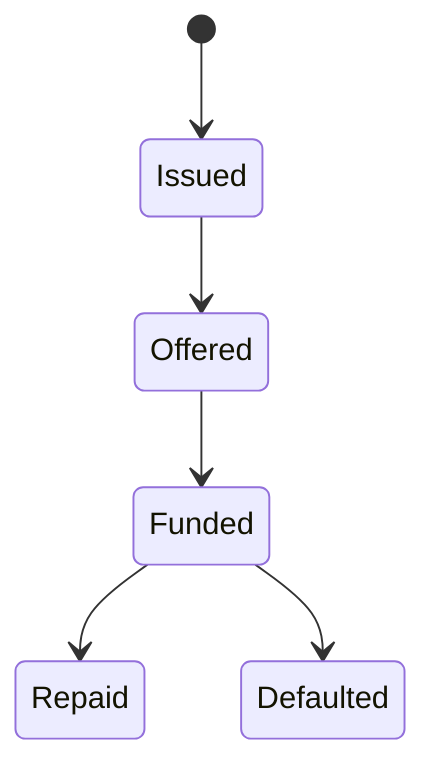
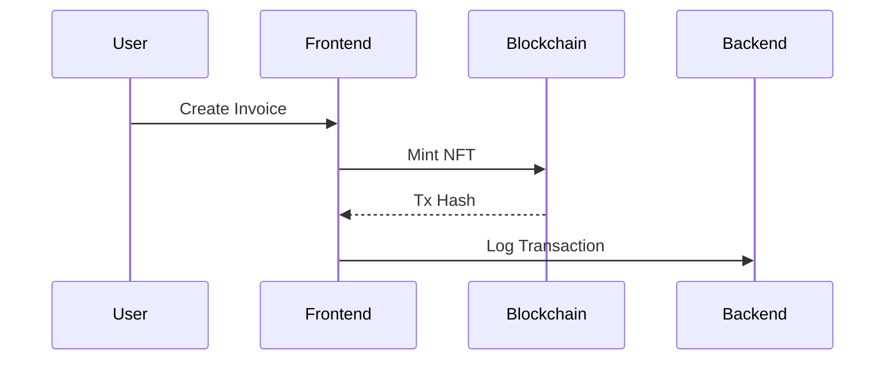

# Software Requirements Specification

## for Invoice Finance dApp

Version 1.0 Approved
Prepared by Saviour Uzoukwu
Coxygen / Cardano Plutus Project
2026

---

# Table of Contents
<!-- TOC -->
1. Introduction  
   1.1 Purpose  
   1.2 Document Conventions  
   1.3 Intended Audience and Reading Suggestions  
   1.4 Project Scope  
   1.5 References  

2. Overall Description  
   2.1 Product Perspective  
   2.2 Product Features  
   2.3 User Classes and Characteristics  
   2.4 Operating Environment  
   2.5 Design and Implementation Constraints  
   2.6 User Documentation  
   2.7 Assumptions and Dependencies  

3. System Features  
   3.1 Invoice Creation (Tokenization)  
       3.1.1 Description and Priority  
       3.1.2 Stimulus/Response  
       3.1.3 Functional Requirements  
   3.2 Invoice Funding  
       3.2.1 Description  
       3.2.2 Requirements  
   3.3 Invoice Repayment  
       3.3.1 Description  
       3.3.2 Requirements  
   3.4 Transaction Logging  
       3.4.1 Description  
       3.4.2 Requirements  

4. External Interface Requirements  
   4.1 User Interfaces  
   4.2 Hardware Interfaces  
   4.3 Software Interfaces  
   4.4 Communications Interfaces  

5. Other Nonfunctional Requirements  
   5.1 Performance Requirements  
   5.2 Safety Requirements  
   5.3 Security Requirements  
   5.4 Software Quality Attributes  

6. Other Requirements  

Appendix A: Glossary  
Appendix B: Analysis Models  
   B.1 Invoice Lifecycle  
   B.2 System Flow  
Appendix C: Issues List  
<!-- TOC -->
---

# Revision History

| Name            | Date | Reason For Changes | Version |
| --------------- | ---- | ------------------ | ------- |
| Saviour Uzoukwu | 2026 | Initial Draft      | 1.0     |

---

# 1. Introduction

## 1.1 Purpose

This document specifies the requirements for the Invoice Finance dApp, a blockchain-based system that enables invoice tokenization and decentralized financing on the Cardano network.

---

## 1.2 Document Conventions

* Requirements are labeled using **REQ-XXX**
* “Shall” indicates mandatory behavior
* Code references follow Plutus V2 conventions

---

## 1.3 Intended Audience and Reading Suggestions

This document is intended for:

* Developers → Implementation details
* Auditors → Security validation
* Testers → Verification requirements
* Stakeholders → System overview

Reading order:

1. Introduction
2. Overall Description
3. System Features

---

## 1.4 Project Scope

The Invoice Finance dApp enables:

* SMEs to tokenize invoices as NFTs
* Investors to fund invoices
* Smart contracts to enforce repayment

### Goals

* Decentralized financing
* Transparent transaction tracking
* Secure asset ownership

---

## 1.5 References

* Cardano Plutus Documentation
* CIP-30 Wallet Standard
* Lucid Library
* Blockfrost API

---

# 2. Overall Description

## 2.1 Product Perspective

The system is a hybrid architecture combining blockchain and backend services.

---

## 2.2 Product Features

* Invoice NFT minting
* Invoice marketplace
* Funding mechanism
* Repayment system
* Transaction history

---

## 2.3 User Classes and Characteristics

| User           | Description             |
| -------------- | ----------------------- |
| Supplier (SME) | Creates invoices        |
| Investor       | Funds invoices          |
| Buyer          | Pays invoice indirectly |
| Auditor        | Reviews transactions    |

---

## 2.4 Operating Environment

* Browser (Chrome, Edge)
* Cardano Testnet
* Wallet: Lace (CIP-30)
* Backend: PHP + MySQL

---

## 2.5 Design and Implementation Constraints

* Plutus V2 smart contracts
* Metadata size limits (64 bytes)
* UTxO model constraints
* Blockchain transaction fees

---

## 2.6 User Documentation

* User Manual (HTML pages)
* Wallet connection guide
* Transaction guide

---

## 2.7 Assumptions and Dependencies

* Users have ADA wallets
* Backend server available
* Blockchain network operational

---

# 3. System Features

---

## 3.1 Invoice Creation (Tokenization)

### 3.1.1 Description and Priority

Allows SMEs to mint invoices as NFTs.
Priority: **High**

---

### 3.1.2 Stimulus/Response

| Action         | Response          |
| -------------- | ----------------- |
| Upload invoice | NFT created       |
| Submit form    | Transaction built |

---

### 3.1.3 Functional Requirements

* REQ-INV-001: System shall mint NFT
* REQ-INV-002: NFT must be unique
* REQ-INV-003: NFT must be locked in contract

---

## 3.2 Invoice Funding

### Description

Investor funds invoice and becomes beneficiary

Priority: High

### Requirements

* REQ-FUND-001: Only unfunded invoice can be funded
* REQ-FUND-002: Investor must sign transaction
* REQ-FUND-003: ADA must be transferred to issuer

---

## 3.3 Invoice Repayment

### Description

Issuer repays investor

Priority: High

### Requirements

* REQ-REP-001: Invoice must be funded
* REQ-REP-002: Repayment ≥ agreed amount
* REQ-REP-003: Investor receives profit

---

## 3.4 Transaction Logging

### Description

Store all transactions

Priority: Medium

### Requirements

* REQ-TX-001: Store tx_hash
* REQ-TX-002: Store wallet addresses
* REQ-TX-003: Store amounts

---

# 4. External Interface Requirements

---

## 4.1 User Interfaces

* Web dashboard
* Wallet connect button
* Invoice cards

---

## 4.2 Hardware Interfaces

* User device (PC/mobile)
* Internet connection

---

## 4.3 Software Interfaces

* Cardano wallet (CIP-30)
* Blockfrost API
* PHP backend

---

## 4.4 Communications Interfaces

* HTTPS API calls
* Blockchain transactions
* JSON communication

---

# 5. Other Nonfunctional Requirements

---

## 5.1 Performance Requirements

* Transactions confirmed within network time
* UI loads < 3 seconds

---

## 5.2 Safety Requirements

* Prevent invalid transactions
* Reject duplicate funding

---

## 5.3 Security Requirements

* Wallet signature required
* No private key storage
* Hash sensitive data

---

## 5.4 Software Quality Attributes

* Reliability: High
* Scalability: Medium
* Maintainability: High
* Usability: High

---

# 6. Other Requirements

* MySQL database required
* PHP backend required
* Blockchain dependency

---

# Appendix A: Glossary

| Term | Definition                 |
| ---- | -------------------------- |
| NFT  | Non-Fungible Token         |
| PKH  | Public Key Hash            |
| UTxO | Unspent Transaction Output |

---

# Appendix B: Analysis Models

## Invoice Lifecycle

---

## System Flow

---

# Appendix C: Issues List

| Issue                   | Status   |
| ----------------------- | -------- |
| Metadata size limits    | Resolved |
| Wallet binding security | Pending  |
| Scaling concerns        | Pending  |
