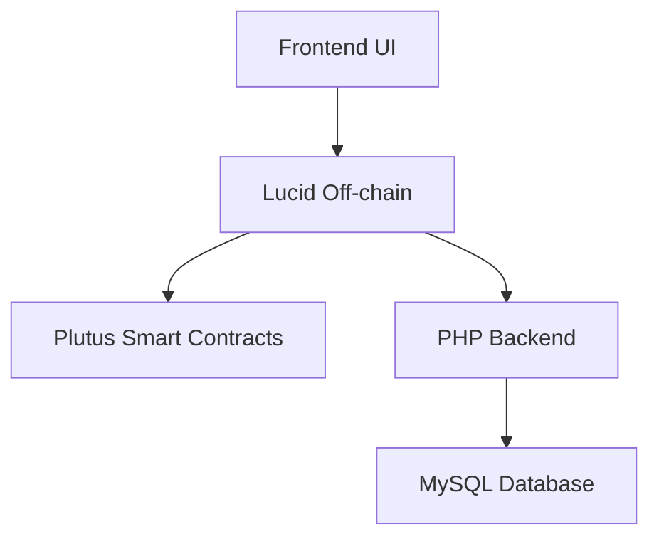
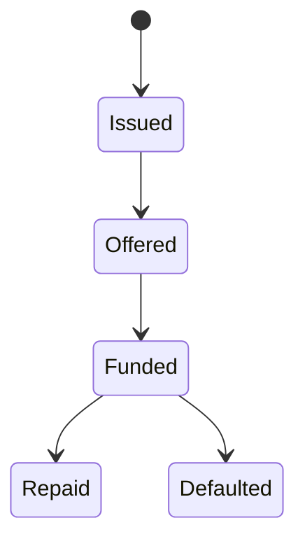

# Software Requirements Specification

## For Invoice Finance dApp

Version 1.0
Prepared by Saviour Uzoukwu
Coxygen / Cardano Plutus Project
2026

---

## Table of Contents

<!-- TOC -->

* [1. Introduction](#1-introduction)
* [2. Product Overview](#2-product-overview)
* [3. Requirements](#3-requirements)
* [4. Verification](#4-verification)
* [5. Appendixes](#5-appendixes)

<!-- TOC -->

---

# 1. Introduction

## 1.1 Document Purpose

This Software Requirements Specification (SRS) defines the functional and non-functional requirements of the Invoice Finance dApp.

It is intended for developers, auditors, testers, and stakeholders to understand what the system must do and how it will be validated.

---

## 1.2 Product Scope

The Invoice Finance dApp enables SMEs to tokenize invoices as NFTs and receive early financing from investors on the Cardano blockchain.

The system provides:

* Invoice tokenization
* Funding marketplace
* Repayment enforcement
* Transaction tracking

Out of scope:

* Legal enforcement of invoices
* Real-world credit scoring

---

## 1.3 Definitions, Acronyms, and Abbreviations

| Term | Definition                                 |
| ---- | ------------------------------------------ |
| NFT  | Non-Fungible Token representing an invoice |
| SME  | Small and Medium Enterprise                |
| PKH  | Public Key Hash                            |
| dApp | Decentralized Application                  |
| UTxO | Unspent Transaction Output                 |

---

## 1.4 References

* Cardano Plutus Documentation
* CIP-30 Wallet Standard
* Project Smart Contracts (Invoice Validator & Policy)

---

## 1.5 Document Overview

* Section 2: Product overview and actors
* Section 3: Functional + system requirements
* Section 4: Verification methods
* Section 5: Supporting materials

---

# 2. Product Overview

## 2.1 Product Perspective

The system is a blockchain-based invoice financing platform.

### Architecture Overview

---

## 2.2 Product Functions

* Create invoice (mint NFT)
* Fund invoice
* Repay investor
* Track transactions
* Wallet authentication

---

## 2.3 Product Constraints

* Must run on Cardano Testnet
* Must support CIP-30 wallets (e.g., Lace)
* Must respect metadata size limits
* Must use Plutus V2 scripts

---

## 2.4 User Characteristics

| Role           | Description                           |
| -------------- | ------------------------------------- |
| Supplier (SME) | Creates invoices and receives funding |
| Investor       | Funds invoices and earns returns      |
| Buyer          | Indirect payer of invoice             |
| Auditor        | Reviews transactions                  |

---

## 2.5 Assumptions and Dependencies

* Users have Cardano wallets
* Blockchain network is available
* Backend server is operational

---

## 2.6 Apportioning of Requirements

| Component | Responsibility        |
| --------- | --------------------- |
| On-chain  | Validation logic      |
| Off-chain | Transaction building  |
| Backend   | Storage and analytics |
| Frontend  | User interaction      |

---

# 3. Requirements

---

## 3.1 External Interfaces

### 3.1.1 User Interfaces

* Web-based UI
* Wallet connect button
* Dashboard and forms

---

### 3.1.3 Software Interfaces

* Cardano wallet (CIP-30)
* Blockfrost API
* PHP backend API

---

## 3.2 Functional

---

### REQ-FUNC-001

* Title: Create Invoice
* Statement: The system shall allow a supplier to mint an invoice NFT.
* Acceptance Criteria: NFT successfully minted
* Verification: Test

---

### REQ-FUNC-002

* Title: Fund Invoice
* Statement: The system shall allow an investor to fund an invoice.
* Acceptance Criteria: ADA transferred to supplier
* Verification: Test

---

### REQ-FUNC-003

* Title: Repay Invoice
* Statement: The system shall allow repayment to investor.
* Acceptance Criteria: Investor receives repayment + profit
* Verification: Test

---

### REQ-FUNC-004

* Title: Transaction Logging
* Statement: The system shall store transactions in database.
* Acceptance Criteria: Entry exists in DB
* Verification: Inspection

---

## 3.3 Quality of Service

---

### 3.3.1 Performance

* Transactions processed within blockchain confirmation time

---

### 3.3.2 Security

* Wallet signature required
* Smart contract enforces rules
* Hashing for wallet storage

---

### 3.3.3 Reliability

* System retries failed transactions
* Backend logs all activity

---

### 3.3.4 Availability

* System available 24/7 (testnet dependent)

---

### 3.3.5 Observability

* Logs stored in database
* Transaction history visible

---

## 3.4 Compliance

* Must follow Cardano standards
* Must follow wallet connection protocols

---

## 3.5 Design and Implementation

---

### 3.5.1 Installation

* Runs on web browser
* Requires Cardano wallet

---

### 3.5.2 Build and Delivery

* Smart contracts compiled to CBOR
* Frontend deployed via hosting

---

### 3.5.3 Distribution

* Web-based deployment

---

### 3.5.4 Maintainability

* Modular smart contracts
* Separated backend

---

### 3.5.6 Portability

* Works on any browser

---

## 3.6 AI/ML

Not applicable

---

# 4. Verification

| Requirement ID | Method     | Status  |
| -------------- | ---------- | ------- |
| REQ-FUNC-001   | Test       | Pending |
| REQ-FUNC-002   | Test       | Pending |
| REQ-FUNC-003   | Test       | Pending |
| REQ-FUNC-004   | Inspection | Pending |

---

# 5. Appendixes

## A. Lifecycle Model

---

## B. Key Tradeoffs

| On-chain  | Off-chain |
| --------- | --------- |
| Secure    | Scalable  |
| Expensive | Cheap     |
| Immutable | Flexible  |

---

## C. Security Model

* Signature-based validation
* Smart contract enforcement
* No private keys stored

---
